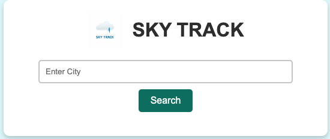

# Sky Track 🌤

Sky Track is a weather application that allows users to search for weather information based on city names. It fetches real-time weather data, including temperature, weather conditions, wind speed, humidity, and pressure, using the OpenWeatherMap API.

## Features

#### 🌍 City-based weather search: Enter any city name to fetch the current weather details.

#### 🌡️ Temperature display: Displays temperature in Celsius.

#### 🌦️ Weather conditions: Shows weather description and an appropriate weather icon.

#### 💨 Wind Speed, Humidity, Pressure: Displays additional weather details like wind speed, humidity, and atmospheric pressure.

#### 🔄 Responsive design: The app adapts to different screen sizes, ensuring a smooth experience on both desktop and mobile devices.

## Demo

[Live Demo](#)

## Screenshots




## Technologies Used

#### HTML5: Markup language for structuring the app.

#### CSS3: Styling for layout, responsiveness, and design.

#### JavaScript (ES6): Core logic for fetching and displaying weather data.

#### OpenWeatherMap API: API service for retrieving real-time weather information.

## Getting Started

Follow these instructions to get a copy of the project running locally.

Prerequisites
A modern web browser
Basic knowledge of HTML, CSS, and JavaScript
OpenWeatherMap API Key
To use the OpenWeatherMap API, you'll need an API key. You can obtain one by signing up for free at the OpenWeatherMap API website.

Once you have the key, replace the placeholder in index.js:

```
const apiKey = "YOUR_API_KEY"; // Replace with your actual API key
```

## Installation

#### Clone the repository

```
git clone https://github.com/syedshamaan/sky-track.git
```

Navigate to the project directory:

```
cd sky-track
```

#### Open the project:

You can open index.html in your preferred browser, or use a local development server like live-server.

### Enter your API key in index.js

## Usage

Enter a city name in the search box.
Click the Search button to fetch the current weather data.
The weather data will be displayed below, showing:

- City and state
- Weather description and icon
- Temperature in Celsius
- Wind speed in meters per second (m/s)
- Humidity in percentage
- Pressure in hectopascals (hPa)
